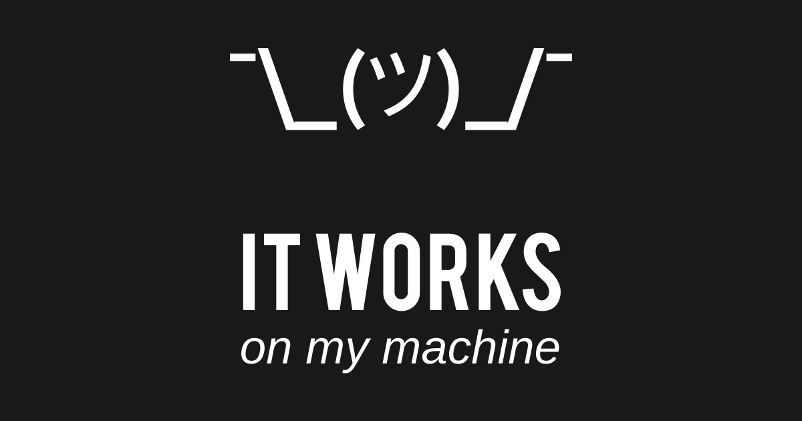
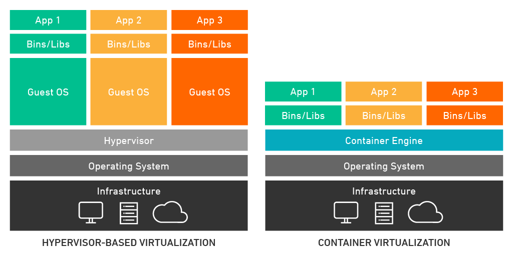
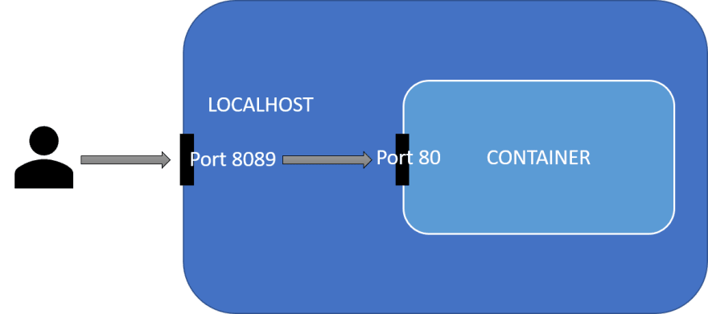

# **Docker**

Slides voor Docker workshop van het IT-lab


---


---


# Meevolgen op:

https://hogent-it-lab.github.io/docker-workshop/slides


---

# Wat is Docker?

- Tool voor ontwikkelen, uitvoeren en deployen van software
- Maakt gebruik van containerisatie-technologie (~virtualisatie op applicatie-niveau)
- Gebaseerd op Linux kernel


---

# Waarom Docker (en containerisatie)?

- Bundelen van software en requirements/dependencies!
- Isoleren van draaiende applicaties van hostsysteem
- Makkelijk verschillende containers op een systeem naast elkaar
- Verdelen van resources hostsysteem -> minder verspilling!

---

# Doel?




---

# Docker versus virtuele machine

- Wat is nu eigenlijk het verschil met een virtuele machine (VM)?

- Virtuele machine: emuleert volledige computer (virtuele hardware!)
- (Docker) container: emuleert op applicatie-niveau
---

# Visualisatie



<!-- Source: https://www.techlistic.com/2023/05/what-is-operating-system.html -->

---

# Bouwstenen van Docker

- Docker Image -> blauwdruk voor een container
  
- Docker Container -> instantie van een image


---

# Docker Image

- Beschrijving van alles dat nodig is voor een applicatie
- Blauwdruk of 'recept'
- Kan je zelf heel custom maken!
- Gebaseerd op een **Dockerfile** (~ 'ingrediënten')

---

# Dockerfile - voorbeeld

```
FROM node:20-alpine   # Kies jouw image
WORKDIR /app
COPY . .              # Kopieer de broncode

# Installeer de dependencies en run de software

RUN yarn install --production
CMD ["node", "./src/index.js"]
```

---

# Docker Container

- Een draaiende instantie van een image
- Geïsoleerde sandbox (los van hostsysteem)*
- Kan je customizen met variabelen
- Vaak ga je een container opspinnen van een bestaande image!

---

# Docker - structuur


---


# Docker installeren

- Algemene stappen te vinden op de officiële [documentatie](https://docs.docker.com/engine/install/)
- Deze demo's: recente versie van Ubuntu Desktop 
- Voor niet-Linux systemen: Docker desktop (!)
- Voorkeur werken in Linux omgeving? -> servers vaak Linux OS

---

# Docker installeren - Ubuntu

- APT repository toevoegen

```
# Add Docker's official GPG key:
sudo apt-get update
sudo apt-get install ca-certificates curl
sudo install -m 0755 -d /etc/apt/keyrings
sudo curl -fsSL https://download.docker.com/linux/ubuntu/gpg -o /etc/apt/keyrings/docker.asc
sudo chmod a+r /etc/apt/keyrings/docker.asc

# Add the repository to Apt sources:
echo \
  "deb [arch=$(dpkg --print-architecture) signed-by=/etc/apt/keyrings/docker.asc] https://download.docker.com/linux/ubuntu \
  $(. /etc/os-release && echo "$VERSION_CODENAME") stable" | \
  sudo tee /etc/apt/sources.list.d/docker.list > /dev/null
sudo apt-get update
```

---

# Docker installeren - Ubuntu

- Meest recente versie downloaden van de software

`sudo apt-get install docker-ce docker-ce-cli containerd.io docker-buildx-plugin docker-compose-plugin`

---

# Docker installeren - Ubuntu

- QoL upgrade: voeg jouw eigen gebruiker toe aan de `docker`groep! 
  - Dan moet je niet telkens sudo voor het commando zetten...

`sudo usermod -aG docker <jouwUserHere>`


---

# Docker gebruiken - beheren van containers

- Kijken welke containers momenteel draaien
  
`docker ps`

- Een container manueel opstarten
  
`docker run <container> <parameters>`


---

# Container opstarten - hello world

Start jouw eerste testcontainer:

`docker run hello-world`


---

# Docker - containerbeheer

- Een specifieke container stopzetten 
  
`docker stop <container>`

- Een specifieke container verwijderen

`docker rm <container>`

- Een specifieke image verwijderen

`docker rmi <image>`

---
# Port bindings

- Jouw container op het hostsysteem kan één of meerdere poorten beschikbaar stellen
- Klassieke voorbeelden:    
  - 80 voor een webserver
  - 3306 voor een databank
  - 25565 voor minecraft server (misschien iets minder klassiek...)
- Concept van port binding: een poort van een container koppelen aan een poort van het hostsysteem

---


# Port bindings - visueel




---

# Data bijhouden

- Docker houdt voor jou data bij in bepaalde **volumes**
- Kan je zelf declareren bij docker commando's (zie later)
- Doel: als je container stopt, dan verlies je niet alle data!


---

# Volume binding

- Alternatief voor Docker volumes
- Mappen/bestanden van jouw Docker container RECHTSTREEKS binden aan het hostsysteem -> **bind mount**
- Nuttig voor data-persistentie
- Biedt mogelijkheden voor het maken van backups
- Live aanpassingen maken (development en testen!)

---

# Docker - handige commando's

- Een interactieve shell openen in een specifieke container
  
`docker exec -ti <container> <shell>`

- Verwijder ongebruikte images en containers

`docker system prune -a`

---

# Docker gebruiken - Docker Compose


- Docker run commando's: handig maar omslachtig...
- Wat met meerdere containers tegelijk opstarten?
- Oplossing: Docker Compose!


---

# Docker demo - Minecraft server


- Eigen Minecraft server opstarten in een container
- Volume binding voor de data van de server
- Speel Minecraft op een server die je zelf in beheer hebt!

---

# Docker networking

- Standaard: Docker regelt vanalles zelf under the hood
- Je kan zelf (interne) Docker netwerken declareren
- Nut? Isolatie van netwerken, overzicht, veiligheid,...

---

# Nuttige links - Docker

- [Docker documentatie](https://docs.docker.com/)
- [Docker installatie](https://docs.docker.com/engine/install/)
- [Docker Compose documentatie](https://docs.docker.com/compose/)
- [Docker Networking documentatie](https://docs.docker.com/network/)

---

# Nuttige links - Docker

- [Composerize](https://composerize.com/) - `docker run` commando naar docker-compose
  
- [DockerHub](https://hub.docker.com/)
  
- [Docker cheat sheet](https://docs.docker.com/get-started/docker_cheatsheet.pdf)