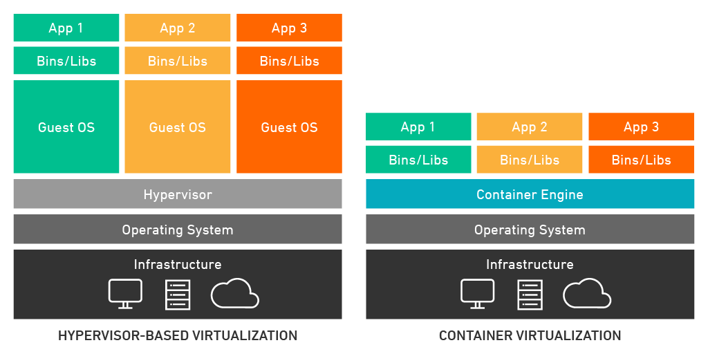

# **Docker**

Slides voor Docker workshop van het IT-lab


---


---


# Meevolgen op:

https://hogent-it-lab.github.io/docker-workshop/slides


---

# Wat is Docker?

- Tool voor ontwikkelen, uitvoeren en deployen van software
- Maakt gebruik van containerisatie-technologie (~virtualisatie op applicatie-niveau)
- Gebaseerd op Linux kernel


---

# Waarom Docker (en containerisatie)?

- Bundelen van software en requirements/dependencies!
- Isoleren van draaiende applicaties van hostsysteem
- Makkelijk verschillende containers op een systeem naast elkaar
- Verdelen van resources hostsysteem -> minder verspilling!

---


# Wie gebruikt Docker?

- Spotify 
- Netflix
- PayPal
- En nog zo veel meer...

---

# Doel?


---

# Docker versus virtuele machine

- Wat is nu eigenlijk het verschil met een virtuele machine (VM)?

- Virtuele machine: emuleert volledige computer (virtuele hardware!)
- (Docker) container: emuleert op applicatie-niveau
---

# Visualisatie



<!-- Source: https://www.techlistic.com/2023/05/what-is-operating-system.html -->

---

# Bouwstenen van Docker

- Docker Image -> blauwdruk voor een container
  
- Docker Container -> instantie van een image


---

# Docker Image

- Beschrijving van alles dat nodig is voor een applicatie
- Blauwdruk of 'recept'
- Kan je zelf heel custom maken!
- Gebaseerd op een **Dockerfile** (~ 'ingrediënten')

---

# Dockerfile - voorbeeld

```
FROM node:20-alpine   # Kies jouw image
WORKDIR /app
COPY . .              # Kopieer de broncode

# Installeer de dependencies en run de software

RUN yarn install --production
CMD ["node", "./src/index.js"]
```

---

# Docker Container

- Een draaiende instantie van een image
- Geïsoleerde sandbox (los van hostsysteem)*
- Kan je customizen met variabelen
- Vaak ga je een container opspinnen van een bestaande image!

---

# Docker - structuur


---


# Docker installeren

- Algemene stappen te vinden op de officiële [documentatie](https://docs.docker.com/engine/install/)
- Deze demo's: recente versie van Ubuntu Desktop
- Voor niet-Linux systemen: Docker desktop (!)
- Voorkeur werken in Linux omgeving? -> servers vaak Linux OS

---

# Docker installeren - Ubuntu

- APT repository toevoegen
Note: commando's regel per regel uitvoeren! 

```bash
# Add Docker's official GPG key:
sudo apt-get update
sudo apt-get install ca-certificates curl
sudo install -m 0755 -d /etc/apt/keyrings
sudo curl -fsSL https://download.docker.com/linux/ubuntu/gpg -o /etc/apt/keyrings/docker.asc
sudo chmod a+r /etc/apt/keyrings/docker.asc

# Add the repository to Apt sources:
echo \
  "deb [arch=$(dpkg --print-architecture) signed-by=/etc/apt/keyrings/docker.asc] https://download.docker.com/linux/ubuntu \
  $(. /etc/os-release && echo "$VERSION_CODENAME") stable" | \
  sudo tee /etc/apt/sources.list.d/docker.list > /dev/null

sudo apt-get update
```

---

# Docker installeren - Ubuntu

- Meest recente versie downloaden van de software

`sudo apt-get install docker-ce docker-ce-cli containerd.io docker-buildx-plugin docker-compose-plugin`

---

# Docker installeren - Ubuntu

- QoL upgrade: voeg jouw eigen gebruiker toe aan de `docker`groep! 
  - Dan moet je niet telkens sudo voor het commando zetten...

`sudo usermod -aG docker <jouwUserHere>`


---

# Docker gebruiken - beheren van containers

- Kijken welke containers momenteel draaien
  
`docker ps`

- Een container manueel opstarten
  
`docker run <image> <parameters>`


---

# Container opstarten - hello world

Start jouw eerste testcontainer:

`docker run hello-world`

---

# Container opstarten - wat gebeurt er?

- Docker zal kijken of jouw gewenste image lokaal aanwezig is
- Niet aanwezig? Docker zal de image downloaden van Dockerhub
- Container wordt gemaakt op basis van de image en variabelen
- Container zal opstarten en zijn taak uitvoeren!

---

# DockerHub

- Plaats waar je [images kan vinden en downloaden](https://hub.docker.com/)
- Don't reinvent the wheel!


---


---
# Docker - containerbeheer images

- Kijken welke images beschikbaar zijn op jouw systeem

`docker image list`

- Een specifieke image verwijderen

`docker rmi <image>`

---

# Docker - containerbeheer container

- Alle containers bekijken (ook gestopte containers)

`docker ps -a`

- Een specifieke container stopzetten 
  
`docker stop <container>`

- Een specifieke container verwijderen

`docker rm <container>`

---
# Port bindings

- Jouw containers op het hostsysteem kunnen één of meerdere poorten beschikbaar stellen
- Klassieke voorbeelden:
  - 80 voor een webserver
  - 3306 voor een databank
  - 25565 voor minecraft server (misschien iets minder klassiek...)
- Concept van port binding: een poort van een container koppelen aan een poort van het hostsysteem

---


# Port bindings - visueel


---

# Port binding - demo

- Gebruik volgende run commando:

`docker run -p 8089:80 --name webserver nginx`

OF

`docker run -d -p 8089:80 --name webserver nginx`

- Open een browser en surf naar http://localhost:8089

- Je ziet nu een webserver die je zelf aan het hosten bent op jouw eigen systeem!

--- 

# Docker gebruiken - Docker Compose


- `docker run` commando's: handig maar omslachtig...
  
- Wat met meerdere containers tegelijk opstarten?
  
- Een oplossing: Docker compose!
  
- Beschrijving van container(s) in yaml formaat: `docker-compose.yaml`


---

# Docker Compose - nginx voorbeeld

`docker run -p 8089:80 --name webserver nginx`

WORDT in `docker-compose.yaml`:

```yml
name: nginx
services:
    nginx:
        ports:
            - 8089:80
        container_name: webserver
        image: nginx
```

---

# Docker compose - gebruik

- Containers opstarten met compose (in achtergrond)
`docker compose up -d`

- Containers stopzetten met compose
`docker compose down`


---

# Docker compose - nginx voorbeeld

- Plaats de `docker-compose.yaml` file van nginx ergens op jouw systeem
  
- Open de terminal in deze map en gebruik `docker compose up -d` om de container te starten


---
# Data bijhouden

- Docker houdt voor jou data bij in bepaalde **volumes**
- Kan je zelf declareren bij docker commando's (zie later)
- Doel: als je container stopt, dan verlies je niet alle data!

---

# Volume binding

- Alternatief voor Docker volumes
- Mappen/bestanden van jouw Docker container RECHTSTREEKS binden aan het hostsysteem -> **bind mount**
- Nuttig voor data-persistentie
- Biedt mogelijkheden voor het maken van backups
- Live aanpassingen maken (development en testen!)

---
# Bind mount - nginx

- Pas de `docker-compose.yaml` aan of maak een nieuwe aan met de bind mount
- Maak in dezelfde map als `docker-compose.yaml` een map `nginx-root`
- Zet hierin een index.html bestand 

---
# Docker compose file

```yaml
name: nginx
services:
    nginx:
        ports:
            - 8089:80
        container_name: webserver
        volumes:
          - ./nginx-root:/usr/share/nginx/html
        image: nginx
```

---

# index.html

```html
<!DOCTYPE html>
<html lang="en">
<head>
    <meta charset="UTF-8">
    <meta name="viewport" content="width=device-width, initial-scale=1.0">
    <title>Docker demo</title>
</head>
<body>
    <h1>Dit is nieuwe content!</h1>
</body>
</html>
```


---
# Directory overzicht

- Je zou onderstaande structuur moeten bekomen
- Indien correct: probeer `docker compose up -d`
- Surf opnieuw naar http://localhost:8089

```
alexander@docker-demo:~/Desktop/nginx-volume-bind$ tree
.
├── docker-compose.yaml
└── nginx-root
    └── index.html

2 directories, 2 files
```


---

# Docker - handige commando's

- Een interactieve shell openen in een specifieke container
  
`docker exec -ti <container> <shell>`

- Verwijder ongebruikte images en containers

`docker system prune -a`

---

# Leuk voorbeld - Minecraft server


- Eigen Minecraft server opstarten in een container
- Volume binding voor de data van de server
- Speel Minecraft op een server die je zelf in beheer hebt!

---
# Minecraft - docker compose

```yaml
services:
    minecraft-server:
        image: itzg/minecraft-server
        container_name: minecraft-server
        environment:
            EULA: "true"
            # VERSION: "1.18.1" # Specify version
        ports:
            - "25565:25565"
        volumes:
            - ./server-data:/data
        stdin_open: true
        tty: true
        restart: unless-stopped
```
---

# Docker networking

- Standaard: Docker regelt vanalles zelf under the hood
- Je kan zelf (interne) Docker netwerken declareren
- Nut? Isolatie van netwerken, overzicht, veiligheid,...

---

# Nuttige links - Docker

- [Docker documentatie](https://docs.docker.com/)
- [Docker installatie](https://docs.docker.com/engine/install/)
- [Docker Compose documentatie](https://docs.docker.com/compose/)
- [Docker Networking documentatie](https://docs.docker.com/network/)

---

# Nuttige links - Docker

- [Composerize](https://composerize.com/) - `docker run` commando naar docker-compose
  
- [DockerHub](https://hub.docker.com/)
  
- [Docker cheat sheet](https://docs.docker.com/get-started/docker_cheatsheet.pdf)